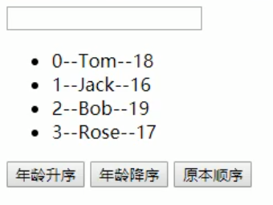

# flexbox

1. 给一个container property=&gt; display：flex；
2. 根据你想要的效果来安排里面的element。

**justify-content:**这个跟word文档的左对齐，右对齐，居中有点像。

**align-items**: 和justify-content有点像。但是是以横轴为中心排列。

**flex-direction**: 管控element的方向的

**Order:** 不再是再container里写了，而是再individual element里面定义， 有点像comparator里的写法-1代表优先级最高，etc。

**align-self**： element版的align-items， 可以让这个element特立独行，实现自己的align。

**flex-wrap**: 定义如果element过多超出一行，是否自动换行。

**flex-flow**: shorten for flex-direction 和flex-wrap。 因为2个经常一起用。

**align-content**: 管理space between lines， 而align-items管理一行里space between element。 所有如果只有一行，是用不到align-content的。

